# Integrated Manufacturing & Operations Suite - System Design Document

**Version:** 1.0  
**Last Updated:** December 2025

---

## Table of Contents
1. [High-Level Architecture Diagram](#1-high-level-architecture-diagram)
2. [Detailed Data Flow Diagram](#2-detailed-data-flow-diagram)
3. [Database Collections & Schemas](#3-database-collections--schemas)
4. [Backend Services & Route Mappings](#4-backend-services--route-mappings)
5. [Frontend Pages](#5-frontend-pages)

---

## 1. High-Level Architecture Diagram

```mermaid
graph TB
    subgraph "Frontend Layer"
        FE[React Frontend<br/>Port 3000]
    end
    
    subgraph "API Gateway"
        NGINX[Kubernetes Ingress<br/>/api/* → Backend]
    end
    
    subgraph "Backend Layer"
        API[FastAPI Backend<br/>Port 8001]
        
        subgraph "Route Modules"
            AUTH[auth_routes]
            DEMAND[demand_routes]
            CPC[cpc_routes]
            BRANCH[branch_ops_routes]
            SKU[sku_management_routes]
            RM[rm_routes]
            VENDOR[vendor_routes]
            TECH[tech_ops_routes]
            INV[inventory_routes]
            PROD[production_routes]
            PROC[procurement_routes]
            QC[quality_routes]
            REPORT[report_routes]
            MRP[mrp_routes]
            PANTONE[pantone_routes]
            DISPATCH[dispatch_lots_v2_routes]
            PRICE[price_master_routes]
            ADMIN[admin_routes]
            EVENTS[event_routes]
            HUB[demand_hub_routes]
            RMPROD[rm_production_routes]
        end
        
        subgraph "Service Layer"
            SKU_SVC[sku_service]
            AUTH_SVC[auth_service]
            RBAC_SVC[rbac_service]
            MRP_SVC[mrp_service]
            INV_SVC[inventory_service]
            L1L2[l1_l2_engine]
            EVENTS_SVC[event_system]
        end
    end
    
    subgraph "Database Layer"
        MONGO[(MongoDB<br/>69 Collections)]
    end
    
    FE -->|HTTP/HTTPS| NGINX
    NGINX -->|/api/*| API
    API --> AUTH & DEMAND & CPC & BRANCH & SKU & RM
    API --> VENDOR & TECH & INV & PROD & PROC & QC
    API --> REPORT & MRP & PANTONE & DISPATCH & PRICE
    API --> ADMIN & EVENTS & HUB & RMPROD
    
    AUTH --> AUTH_SVC
    SKU --> SKU_SVC
    BRANCH --> L1L2
    MRP --> MRP_SVC
    EVENTS --> EVENTS_SVC
    
    AUTH_SVC & SKU_SVC & RBAC_SVC & MRP_SVC --> MONGO
    INV_SVC & L1L2 & EVENTS_SVC --> MONGO
    
    classDef frontend fill:#61dafb,color:#000
    classDef backend fill:#009688,color:#fff
    classDef database fill:#4db33d,color:#fff
    classDef service fill:#ff9800,color:#000
    
    class FE frontend
    class API,AUTH,DEMAND,CPC,BRANCH,SKU,RM,VENDOR,TECH,INV,PROD,PROC,QC,REPORT,MRP,PANTONE,DISPATCH,PRICE,ADMIN,EVENTS,HUB,RMPROD backend
    class MONGO database
    class SKU_SVC,AUTH_SVC,RBAC_SVC,MRP_SVC,INV_SVC,L1L2,EVENTS_SVC service
```

---

## 2. Detailed Data Flow Diagram

```mermaid
flowchart TB
    subgraph "Master Data Collections"
        USERS[(users)]
        ROLES[(roles)]
        PERMS[(permissions)]
        BRANCHES[(branches)]
        BRANDS[(brands)]
        VERTICALS[(verticals)]
        MODELS[(models)]
        BUYERS[(buyers)]
        VENDORS[(vendors)]
    end
    
    subgraph "SKU Data Collections"
        BIDSO_SKUS[(bidso_skus)]
        BUYER_SKUS[(buyer_skus)]
        COMMON_BOM[(common_bom)]
        BRAND_BOM[(brand_specific_bom)]
        SKU_RM_MAP[(sku_rm_mapping)]
    end
    
    subgraph "Inventory Collections"
        BRANCH_RM_INV[(branch_rm_inventory)]
        BRANCH_SKU_INV[(branch_sku_inventory)]
        FG_INV[(fg_inventory)]
        FG_LOG[(fg_production_log)]
    end
    
    subgraph "Raw Material Collections"
        RAW_MATS[(raw_materials)]
        RM_CATEGORIES[(rm_categories)]
        RM_PARAMS[(rm_procurement_parameters)]
        RM_MOVEMENTS[(rm_stock_movements)]
        RM_CONSUMPTION[(rm_consumption_log)]
    end
    
    subgraph "Production Collections"
        PROD_SCHEDULES[(production_schedules)]
        PROD_PLANS[(production_plans)]
        PROD_ENTRIES[(production_entries)]
        PROD_BATCHES[(production_batches)]
    end
    
    subgraph "Demand & Dispatch Collections"
        FORECASTS[(forecasts)]
        MODEL_FORECASTS[(model_level_forecasts)]
        DISPATCH_LOTS[(dispatch_lots)]
        DISPATCH_LINES[(dispatch_lot_lines)]
        DISPATCH_V2[(dispatch_lots_v2)]
    end
    
    subgraph "Procurement Collections"
        PO[(purchase_orders)]
        PO_LINES[(purchase_order_lines)]
        PURCHASE_ENTRIES[(purchase_entries)]
        IBT[(ibt_transfers)]
        IBT_SHORT[(ibt_shortages)]
    end
    
    subgraph "Backend Routes"
        R_AUTH[auth_routes.py]
        R_DEMAND[demand_routes.py]
        R_CPC[cpc_routes.py]
        R_BRANCH[branch_ops_routes.py]
        R_SKU[sku_management_routes.py]
        R_RM[rm_routes.py]
        R_VENDOR[vendor_routes.py]
        R_TECH[tech_ops_routes.py]
        R_INV[inventory_routes.py]
        R_PROD[production_routes.py]
        R_PROC[procurement_routes.py]
        R_QC[quality_routes.py]
        R_MRP[mrp_routes.py]
    end
    
    %% Auth Routes
    R_AUTH -->|READ| USERS
    R_AUTH -->|WRITE| USERS
    
    %% Demand Routes
    R_DEMAND -->|READ| FORECASTS & BUYERS & BRANDS & VERTICALS & MODELS
    R_DEMAND -->|READ| DISPATCH_LOTS & DISPATCH_LINES & FG_INV & PROD_SCHEDULES
    R_DEMAND -->|WRITE| FORECASTS & DISPATCH_LOTS & DISPATCH_LINES
    
    %% CPC Routes
    R_CPC -->|READ| BRANCHES & PROD_SCHEDULES & BRANCH_RM_INV
    R_CPC -->|WRITE| PROD_SCHEDULES & BRANCHES
    
    %% Branch Ops Routes
    R_BRANCH -->|READ| BUYER_SKUS & COMMON_BOM & BRAND_BOM & RAW_MATS & BRANCHES
    R_BRANCH -->|READ| PROD_SCHEDULES & BRANCH_RM_INV
    R_BRANCH -->|WRITE| PROD_SCHEDULES & FG_INV & FG_LOG & RM_CONSUMPTION & BRANCH_SKU_INV
    
    %% SKU Management Routes
    R_SKU -->|READ| BIDSO_SKUS & BUYER_SKUS & BRANDS & VERTICALS & MODELS
    R_SKU -->|READ| COMMON_BOM & BRAND_BOM & RAW_MATS
    R_SKU -->|WRITE| BIDSO_SKUS & BUYER_SKUS & COMMON_BOM & BRAND_BOM
    
    %% RM Routes
    R_RM -->|READ| RAW_MATS & RM_CATEGORIES & BRANCH_RM_INV & BRANDS & VERTICALS & MODELS
    R_RM -->|WRITE| RAW_MATS & BRANCH_RM_INV
    
    %% Vendor Routes
    R_VENDOR -->|READ| VENDORS & RAW_MATS & PURCHASE_ENTRIES
    R_VENDOR -->|WRITE| VENDORS & PURCHASE_ENTRIES & RM_MOVEMENTS
    
    %% Tech Ops Routes
    R_TECH -->|READ| VERTICALS & MODELS & BRANDS & BUYERS & BRANCHES & DISPATCH_LOTS
    R_TECH -->|WRITE| VERTICALS & MODELS & BRANDS & BUYERS & BRANCHES
    
    %% Production Routes
    R_PROD -->|READ| PROD_PLANS & PROD_BATCHES & PROD_ENTRIES & RAW_MATS & FORECASTS
    R_PROD -->|WRITE| PROD_PLANS & PROD_BATCHES & PROD_ENTRIES & FG_INV & RM_MOVEMENTS
    
    %% Procurement Routes
    R_PROC -->|READ| PO & PO_LINES & IBT & RAW_MATS & BUYER_SKUS & BRANCH_RM_INV & BRANCH_SKU_INV
    R_PROC -->|WRITE| PO & PO_LINES & IBT & IBT_SHORT & BRANCH_RM_INV & BRANCH_SKU_INV
    
    %% MRP Routes
    R_MRP -->|READ| MODEL_FORECASTS & BIDSO_SKUS & COMMON_BOM & RAW_MATS & RM_PARAMS & VENDORS
    R_MRP -->|WRITE| MRP_RUNS & MRP_DRAFT_POS
    
    classDef collection fill:#4db33d,color:#fff
    classDef route fill:#2196f3,color:#fff
    
    class USERS,ROLES,PERMS,BRANCHES,BRANDS,VERTICALS,MODELS,BUYERS,VENDORS collection
    class BIDSO_SKUS,BUYER_SKUS,COMMON_BOM,BRAND_BOM,SKU_RM_MAP collection
    class BRANCH_RM_INV,BRANCH_SKU_INV,FG_INV,FG_LOG collection
    class RAW_MATS,RM_CATEGORIES,RM_PARAMS,RM_MOVEMENTS,RM_CONSUMPTION collection
    class PROD_SCHEDULES,PROD_PLANS,PROD_ENTRIES,PROD_BATCHES collection
    class FORECASTS,MODEL_FORECASTS,DISPATCH_LOTS,DISPATCH_LINES,DISPATCH_V2 collection
    class PO,PO_LINES,PURCHASE_ENTRIES,IBT,IBT_SHORT collection
    class R_AUTH,R_DEMAND,R_CPC,R_BRANCH,R_SKU,R_RM,R_VENDOR,R_TECH,R_INV,R_PROD,R_PROC,R_QC,R_MRP route
```

---

## 3. Database Collections & Schemas

### 3.1 Master Data Collections

#### `users` (27 documents)
| Field | Type | Description |
|-------|------|-------------|
| id | string | UUID |
| email | string | User email (unique) |
| password_hash | string | SHA256 hashed password |
| name | string | Display name |
| role | string | Primary role code |
| assigned_branches | list | Branch IDs user can access |
| is_active | bool | Active status |
| created_at | string | Timestamp |

#### `roles` (10 documents)
| Field | Type | Description |
|-------|------|-------------|
| id | string | UUID |
| code | string | Role code (e.g., master_admin) |
| name | string | Display name |
| description | string | Role description |
| is_system_role | bool | System-defined role |
| is_active | bool | Active status |
| created_at | string | Timestamp |
| updated_at | string | Timestamp |

#### `branches` (8 documents)
| Field | Type | Description |
|-------|------|-------------|
| id | string | UUID |
| branch_id | string | Branch identifier |
| code | string | Short code |
| name | string | Branch name |
| location | string | Physical location |
| branch_type | string | PRODUCTION/WAREHOUSE/HYBRID |
| capacity_units_per_day | int | Daily production capacity |
| is_active | bool | Active status |
| created_at | datetime | Timestamp |
| capacity_updated_at | datetime | Last capacity update |

#### `brands` (29 documents)
| Field | Type | Description |
|-------|------|-------------|
| id | string | UUID |
| code | string | Brand code |
| name | string | Brand name |
| status | string | ACTIVE/INACTIVE |
| buyer_id | string | Optional linked buyer |

#### `buyers` (85 documents)
| Field | Type | Description |
|-------|------|-------------|
| id | string | UUID |
| customer_code | string | Auto-generated code (CUST001) |
| code | string | Short code |
| name | string | Buyer/Customer name |
| country | string | Country |
| contact_email | string | Email |
| payment_terms_days | int | Payment terms |
| status | string | ACTIVE/INACTIVE |
| created_at | datetime | Timestamp |

#### `verticals` (11 documents)
| Field | Type | Description |
|-------|------|-------------|
| id | string | UUID |
| code | string | Vertical code (e.g., SCOOTER) |
| name | string | Vertical name |
| description | string | Description |
| status | string | ACTIVE/INACTIVE |
| created_at | datetime | Timestamp |

#### `models` (71 documents)
| Field | Type | Description |
|-------|------|-------------|
| id | string | UUID |
| vertical_id | string | Parent vertical ID |
| code | string | Model code |
| name | string | Model name |
| description | string | Description |
| status | string | ACTIVE/INACTIVE |
| created_at | datetime | Timestamp |

#### `vendors` (504 documents)
| Field | Type | Description |
|-------|------|-------------|
| id | string | UUID |
| vendor_id | string | Vendor identifier |
| name | string | Vendor name |
| gst | string | GST number |
| address | string | Address |
| poc | string | Point of contact |
| email | string | Email |
| phone | string | Phone |
| is_active | bool | Active status |
| created_at | string | Timestamp |

---

### 3.2 SKU Data Collections

#### `bidso_skus` (258 documents)
Base product definitions (brand-agnostic).

| Field | Type | Description |
|-------|------|-------------|
| id | string | UUID |
| bidso_sku_id | string | Unique SKU ID (e.g., KS_BE_115) |
| vertical_id | string | Vertical reference |
| vertical_code | string | Denormalized vertical code |
| model_id | string | Model reference |
| model_code | string | Denormalized model code |
| numeric_code | string | Numeric sequence |
| name | string | Product name |
| description | string | Description |
| status | string | ACTIVE/INACTIVE |
| created_at | datetime | Timestamp |
| model_name | string | Denormalized model name |
| vertical_name | string | Denormalized vertical name |

#### `buyer_skus` (693 documents)
Brand-specific product variants.

| Field | Type | Description |
|-------|------|-------------|
| id | string | UUID |
| buyer_sku_id | string | Unique ID (e.g., FC_KS_BE_115) |
| bidso_sku_id | string | Reference to base product |
| brand_id | string | Brand reference |
| brand_code | string | Denormalized brand code |
| buyer_id | string | Optional buyer reference |
| name | string | Product name |
| description | string | Description |
| mrp | float | Maximum retail price |
| selling_price | float | Selling price |
| gst_rate | int | GST percentage |
| hsn_code | string | HSN code |
| status | string | ACTIVE/INACTIVE |
| created_at | datetime | Timestamp |
| updated_at | datetime | Last update |

#### `common_bom` (253 documents)
Bill of Materials for base products.

| Field | Type | Description |
|-------|------|-------------|
| id | string | UUID |
| bidso_sku_id | string | Reference to bidso_sku |
| items | list | Array of {rm_id, quantity, unit} |
| is_locked | bool | Locked for editing |
| created_at | datetime | Timestamp |

#### `brand_specific_bom` (3 documents)
Brand-specific BOM overrides.

| Field | Type | Description |
|-------|------|-------------|
| id | string | UUID |
| bidso_sku_id | string | Reference to bidso_sku |
| brand_id | string | Brand reference |
| brand_code | string | Denormalized brand code |
| items | list | Array of {rm_id, quantity, unit} |
| created_at | datetime | Timestamp |
| updated_at | string | Last update |

#### `sku_rm_mapping` (20,155 documents)
SKU to Raw Material mapping (legacy, being migrated to BOM).

| Field | Type | Description |
|-------|------|-------------|
| id | string | UUID |
| sku_id | string | SKU reference |
| rm_id | string | Raw material reference |
| quantity | float | Required quantity |
| created_at | string | Timestamp |

---

### 3.3 Raw Material Collections

#### `raw_materials` (2,759 documents)
| Field | Type | Description |
|-------|------|-------------|
| id | string | UUID |
| rm_id | string | Unique RM ID |
| category | string | Category code |
| category_data | dict | {description, sub_category, color, size, uom, ...} |
| low_stock_threshold | float | Low stock alert threshold |
| brand_ids | list | Associated brand IDs |
| is_brand_specific | bool | Brand-specific flag |
| model_ids | list | Associated model IDs |
| vertical_ids | list | Associated vertical IDs |
| gst_rate | int | GST percentage |
| hsn_code | string | HSN code |
| bom_level | int | L1/L2 classification |
| source_type | string | PROCURED/IN_HOUSE |
| created_at | string | Timestamp |
| updated_at | string | Last update |

#### `rm_categories` (17 documents)
| Field | Type | Description |
|-------|------|-------------|
| id | string | UUID |
| code | string | Category code |
| name | string | Category name |
| description | string | Description |
| default_source_type | string | PROCURED/IN_HOUSE |
| default_bom_level | int | Default L1/L2 |
| default_uom | string | Default unit of measure |
| description_columns | list | Dynamic columns for category |
| rm_id_prefix | string | Prefix for RM IDs |
| next_sequence | int | Next sequence number |
| is_active | bool | Active status |
| created_at | datetime | Timestamp |
| updated_at | datetime | Last update |

#### `rm_procurement_parameters` (1,302 documents)
| Field | Type | Description |
|-------|------|-------------|
| rm_id | string | Raw material reference |
| reorder_point | float | Reorder threshold |
| reorder_quantity | float | Order quantity |
| lead_time_days | int | Lead time |
| safety_stock | float | Safety stock level |
| preferred_vendor_id | string | Preferred vendor |

#### `vendor_rm_prices` (296 documents)
| Field | Type | Description |
|-------|------|-------------|
| id | string | UUID |
| vendor_id | string | Vendor reference |
| rm_id | string | Raw material reference |
| price | float | Unit price |
| currency | string | Currency code |
| effective_date | string | Price effective date |
| is_active | bool | Active status |
| created_at | string | Timestamp |

---

### 3.4 Inventory Collections

#### `branch_rm_inventory` (2,293 documents)
Raw material stock per branch.

| Field | Type | Description |
|-------|------|-------------|
| id | string | UUID |
| rm_id | string | Raw material reference |
| branch | string | Branch name |
| current_stock | int | Current quantity |
| is_active | bool | Active status |
| activated_at | string | Activation timestamp |

#### `branch_sku_inventory` (1,008 documents)
SKU stock per branch (legacy).

| Field | Type | Description |
|-------|------|-------------|
| id | string | UUID |
| sku_id | string | SKU reference |
| branch | string | Branch name |
| current_stock | float | Current quantity |
| is_active | bool | Active status |
| activated_at | string | Activation timestamp |

#### `fg_inventory` (0 documents currently)
Finished Goods inventory - Source of truth for FG stock.

| Field | Type | Description |
|-------|------|-------------|
| id | string | UUID |
| branch_id | string | Branch reference |
| buyer_sku_id | string | Buyer SKU reference |
| current_stock | int | Current quantity |
| dispatch_lot_id | string | Optional dispatch lot |
| production_batch_id | string | Optional production batch |
| unit_cost | float | Unit cost |
| status | string | AVAILABLE/RESERVED/DISPATCHED |
| qc_approval_id | string | QC approval reference |
| received_at | datetime | Timestamp |

#### `fg_production_log` (4 documents)
Production completion log.

| Field | Type | Description |
|-------|------|-------------|
| id | string | UUID |
| branch | string | Branch name |
| buyer_sku_id | string | Buyer SKU reference |
| quantity | int | Produced quantity |
| schedule_code | string | Production schedule reference |
| produced_at | string | Production timestamp |

#### `rm_stock_movements` (17 documents)
Raw material stock movement log.

| Field | Type | Description |
|-------|------|-------------|
| id | string | UUID |
| movement_code | string | Unique movement code |
| rm_id | string | Raw material reference |
| branch_id | string | Branch reference |
| branch | string | Branch name |
| movement_type | string | INWARD/CONSUMPTION/ADJUSTMENT/TRANSFER |
| quantity | float | Movement quantity |
| unit_of_measure | string | UOM |
| reference_type | string | PRODUCTION_BATCH/PURCHASE_ORDER/IBT |
| reference_id | string | Reference document ID |
| balance_after | float | Balance after movement |
| notes | string | Notes |
| created_at | datetime | Timestamp |

#### `rm_consumption_log` (63 documents)
| Field | Type | Description |
|-------|------|-------------|
| id | string | UUID |
| schedule_code | string | Production schedule reference |
| rm_id | string | Raw material consumed |
| quantity | float | Quantity consumed |
| branch | string | Branch name |
| consumed_at | string | Timestamp |

---

### 3.5 Production Collections

#### `production_schedules` (98 documents)
| Field | Type | Description |
|-------|------|-------------|
| id | string | UUID |
| schedule_code | string | Unique code (PS_YYYYMM_XXXX) |
| forecast_id | string | Optional forecast reference |
| dispatch_lot_id | string | Optional dispatch lot reference |
| branch | string | Production branch |
| sku_id | string | Buyer SKU ID |
| sku_description | string | SKU description |
| target_quantity | int | Target production qty |
| allocated_quantity | int | Allocated qty |
| completed_quantity | int | Completed qty |
| target_date | datetime | Target completion date |
| priority | string | LOW/MEDIUM/HIGH/CRITICAL |
| status | string | PENDING/IN_PROGRESS/COMPLETED |
| notes | string | Notes |
| created_at | datetime | Timestamp |
| completed_at | datetime | Completion timestamp |
| completed_by | string | User who completed |
| has_spillover | bool | Has spillover schedule |
| spillover_quantity | int | Spillover quantity |
| spillover_schedule_id | string | Child spillover schedule |

#### `production_plans` (6 documents)
| Field | Type | Description |
|-------|------|-------------|
| id | string | UUID |
| branch | string | Branch name |
| plan_month | string | Month (YYYY-MM) |
| date | datetime | Specific date |
| sku_id | string | SKU reference |
| planned_quantity | float | Planned quantity |
| created_at | datetime | Timestamp |

#### `production_batches` (0 documents)
| Field | Type | Description |
|-------|------|-------------|
| id | string | UUID |
| batch_code | string | Unique batch code |
| production_plan_id | string | Plan reference |
| dispatch_lot_id | string | Dispatch lot reference |
| branch_id | string | Branch ID |
| branch | string | Branch name |
| sku_id | string | SKU reference |
| planned_quantity | int | Planned qty |
| produced_quantity | int | Produced qty |
| good_quantity | int | QC passed qty |
| rejected_quantity | int | Rejected qty |
| batch_date | datetime | Batch date |
| shift | string | DAY/NIGHT |
| status | string | PLANNED/IN_PROGRESS/COMPLETED/QC_PASSED |
| started_at | datetime | Start timestamp |
| completed_at | datetime | Completion timestamp |

---

### 3.6 Demand & Dispatch Collections

#### `forecasts` (0 documents)
| Field | Type | Description |
|-------|------|-------------|
| id | string | UUID |
| forecast_code | string | Unique forecast code |
| buyer_id | string | Buyer reference |
| vertical_id | string | Vertical reference |
| sku_id | string | SKU reference |
| forecast_month | datetime | Forecast month |
| quantity | int | Forecast quantity |
| priority | string | LOW/MEDIUM/HIGH/CRITICAL |
| status | string | DRAFT/CONFIRMED/CONVERTED |
| notes | string | Notes |
| created_at | datetime | Timestamp |
| confirmed_at | datetime | Confirmation timestamp |

#### `model_level_forecasts` (1,232 documents)
| Field | Type | Description |
|-------|------|-------------|
| id | string | UUID |
| model_id | string | Model reference |
| model_name | string | Model name |
| month_year | string | Month (YYYY-MM) |
| forecast_qty | int | Forecast quantity |
| branch_id | string | Optional branch |
| notes | string | Notes |
| uploaded_at | datetime | Upload timestamp |

#### `dispatch_lots` (1 document)
| Field | Type | Description |
|-------|------|-------------|
| id | string | UUID |
| lot_code | string | Unique lot code |
| forecast_id | string | Forecast reference |
| buyer_id | string | Buyer reference |
| sku_id | string | SKU reference |
| required_quantity | int | Required qty |
| produced_quantity | int | Produced qty |
| qc_passed_quantity | int | QC passed qty |
| dispatched_quantity | int | Dispatched qty |
| target_date | datetime | Target date |
| status | string | CREATED/PRODUCTION_ASSIGNED/DISPATCHED |
| priority | string | Priority level |
| created_at | datetime | Timestamp |

#### `dispatch_lot_lines` (0 documents)
| Field | Type | Description |
|-------|------|-------------|
| id | string | UUID |
| lot_id | string | Parent dispatch lot |
| buyer_sku_id | string | Buyer SKU reference |
| quantity | int | Line quantity |
| scheduled_date | datetime | Scheduled date |
| actual_completion_date | datetime | Actual completion |
| is_delayed | bool | Delay flag |
| status | string | Line status |

#### `dispatch_lots_v2` (8 documents)
Enhanced dispatch lots structure.

| Field | Type | Description |
|-------|------|-------------|
| id | string | UUID |
| lot_number | string | Lot number |
| customer_id | string | Customer/Buyer ID |
| customer_name | string | Customer name |
| status | string | Lot status |
| lines | list | Array of line items |
| total_quantity | int | Total quantity |
| notes | string | Notes |
| created_by | string | Creator user ID |
| created_by_role | string | Creator role |
| created_at | string | Timestamp |
| invoice_data | object | Invoice details |
| invoiced_by | string | Invoiced by user |
| invoiced_at | string | Invoice timestamp |
| dispatched_at | string | Dispatch timestamp |

---

### 3.7 Procurement Collections

#### `purchase_orders` (0 documents)
| Field | Type | Description |
|-------|------|-------------|
| id | string | UUID |
| po_number | string | PO number |
| vendor_id | string | Vendor reference |
| branch_id | string | Branch reference |
| branch | string | Branch name |
| order_date | datetime | Order date |
| expected_delivery_date | datetime | Expected delivery |
| total_amount | float | Total amount |
| currency | string | Currency |
| status | string | DRAFT/SENT/RECEIVED |
| payment_status | string | PENDING/PAID |
| notes | string | Notes |
| created_at | datetime | Timestamp |

#### `purchase_entries` (22 documents)
| Field | Type | Description |
|-------|------|-------------|
| id | string | UUID |
| rm_id | string | Raw material reference |
| quantity | float | Purchased quantity |
| date | string | Purchase date |
| notes | string | Notes |
| created_at | string | Timestamp |

#### `ibt_transfers` (8 documents)
Inter-Branch Transfers.

| Field | Type | Description |
|-------|------|-------------|
| id | string | UUID |
| transfer_code | string | Unique transfer code |
| transfer_type | string | RM/FG |
| source_branch | string | Source branch |
| destination_branch | string | Destination branch |
| item_id | string | RM or SKU ID |
| item_name | string | Item name |
| quantity | float | Transfer quantity |
| dispatched_quantity | float | Dispatched qty |
| received_quantity | float | Received qty |
| status | string | INITIATED/APPROVED/IN_TRANSIT/RECEIVED/COMPLETED |
| initiated_at | string | Initiation timestamp |
| approved_at | string | Approval timestamp |
| dispatched_at | string | Dispatch timestamp |
| received_at | string | Receipt timestamp |
| vehicle_number | string | Vehicle details |
| driver_name | string | Driver name |
| driver_contact | string | Driver contact |
| expected_arrival | string | Expected arrival |
| notes | string | Notes |
| damage_notes | string | Damage notes |
| variance | float | Quantity variance |

---

### 3.8 Other Collections

#### `qc_checklists` (2 documents)
| Field | Type | Description |
|-------|------|-------------|
| id | string | UUID |
| checklist_code | string | Unique code |
| name | string | Checklist name |
| description | string | Description |
| check_type | string | VISUAL/MEASUREMENT/FUNCTIONAL/SAFETY |
| vertical_id | string | Optional vertical filter |
| model_id | string | Optional model filter |
| expected_value | string | Expected value |
| tolerance | string | Tolerance range |
| is_mandatory | bool | Mandatory flag |
| check_priority | int | Priority order |
| status | string | ACTIVE/INACTIVE |

#### `pantone_shades` (118 documents)
| Field | Type | Description |
|-------|------|-------------|
| id | string | UUID |
| pantone_code | string | Pantone code |
| name | string | Shade name |
| hex_color | string | Hex color code |
| rgb | object | RGB values |
| category | string | Color category |
| status | string | ACTIVE/INACTIVE |

#### `price_master` (5 documents)
| Field | Type | Description |
|-------|------|-------------|
| id | string | UUID |
| customer_id | string | Customer reference |
| buyer_sku_id | string | Buyer SKU reference |
| unit_price | float | Unit price |
| currency | string | Currency |
| effective_from | datetime | Effective date |
| is_active | bool | Active status |

#### `events` (0 documents)
| Field | Type | Description |
|-------|------|-------------|
| id | string | UUID |
| event_type | string | Event type |
| module | string | Module name |
| entity_type | string | Entity type |
| entity_id | string | Entity ID |
| payload | object | Event payload |
| status | string | PENDING/PROCESSED |
| created_at | datetime | Timestamp |

#### `audit_logs` (1 document)
| Field | Type | Description |
|-------|------|-------------|
| id | string | UUID |
| entity_type | string | Entity type |
| entity_id | string | Entity ID |
| action | string | CREATE/UPDATE/DELETE |
| old_values | object | Previous values |
| new_values | object | New values |
| user_id | string | User who made change |
| user_email | string | User email |
| ip_address | string | IP address |
| created_at | datetime | Timestamp |

---

## 4. Backend Services & Route Mappings

### 4.1 auth_routes.py
**Prefix:** `/api/auth`

| Endpoint | Method | Reads From | Writes To |
|----------|--------|------------|-----------|
| `/login` | POST | users | - |
| `/register` | POST | users | users |
| `/me` | GET | users | - |
| `/change-password` | POST | users | users |

### 4.2 demand_routes.py
**Prefix:** `/api`

| Endpoint | Method | Reads From | Writes To |
|----------|--------|------------|-----------|
| `/forecasts` | GET | forecasts, production_schedules, dispatch_lot_lines, dispatch_lots | - |
| `/forecasts` | POST | buyers | forecasts |
| `/forecasts/{id}` | PUT | forecasts, buyers | forecasts |
| `/forecasts/{id}` | DELETE | forecasts | forecasts |
| `/dispatch/by-forecast/{id}` | GET | dispatch_lot_lines, forecasts, dispatch_lots | - |
| `/dispatch-lots` | GET | dispatch_lots | - |
| `/dispatch-lots` | POST | - | dispatch_lots |
| `/dispatch-lots/{id}` | GET | dispatch_lots, buyers, dispatch_lot_lines, fg_inventory, production_batches | - |
| `/dispatch-lots/{id}` | PUT | dispatch_lots | dispatch_lots |
| `/dispatch-lots/{id}` | DELETE | dispatch_lots | dispatch_lots, dispatch_lot_lines |
| `/dispatch-lots/{id}/lines` | POST | dispatch_lots | dispatch_lot_lines, dispatch_lots |
| `/dispatch-lots/dashboard-summary` | GET | dispatch_lots, dispatch_lot_lines, fg_inventory, buyers | - |
| `/dispatch-lots/bulk-upload` | POST | buyers | dispatch_lots, dispatch_lot_lines |
| `/forecasts/parse-excel` | POST | verticals, brands, models, buyers, buyer_skus | forecasts |
| `/forecasts/download-error-report` | POST | - | - |

### 4.3 cpc_routes.py
**Prefix:** `/api/cpc`

| Endpoint | Method | Reads From | Writes To |
|----------|--------|------------|-----------|
| `/branches/capacity` | GET | branches, branch_daily_capacity, branch_allocations, production_schedules | - |
| `/branches/{name}/capacity` | GET | branches, branch_daily_capacity, branch_allocations, production_schedules | - |
| `/branches/{name}/capacity` | PUT | branches | branches, capacity_history |
| `/branches/daily-capacity` | GET | branch_daily_capacity | - |
| `/branches/daily-capacity` | POST | branches | branch_daily_capacity |
| `/branches/daily-capacity/bulk` | POST | branches | branch_daily_capacity |
| `/schedules` | GET | production_schedules, branch_allocations | - |
| `/schedules` | POST | branches, production_schedules | production_schedules, dispatch_lots |
| `/schedules/{id}` | GET | production_schedules, branch_allocations | - |
| `/schedules/{id}/allocate` | POST | production_schedules, branches, branch_allocations | branch_allocations, production_schedules |
| `/schedules/{id}/auto-allocate` | POST | production_schedules, branches, branch_allocations | branch_allocations, production_schedules |
| `/rm-shortage-report` | GET | branches, buyer_skus, common_bom, brand_bom, raw_materials, branch_rm_inventory, production_schedules | - |

### 4.4 branch_ops_routes.py
**Prefix:** `/api/branch-ops`

| Endpoint | Method | Reads From | Writes To |
|----------|--------|------------|-----------|
| `/production-schedules` | GET | branches, production_schedules | - |
| `/production-schedules/{id}` | GET | production_schedules | - |
| `/production-schedules/{id}/complete` | POST | production_schedules, buyer_skus, common_bom, brand_bom, raw_materials, branches | production_schedules, dispatch_lots, rm_consumption_log, branch_sku_inventory, fg_inventory, fg_production_log |
| `/production-schedules/{id}/bom` | GET | production_schedules, buyer_skus, common_bom, brand_bom, raw_materials, branch_rm_inventory | - |
| `/dashboard` | GET | branches, production_schedules | - |
| `/rm-shortage-report` | GET | branches, buyer_skus, common_bom, brand_bom, raw_materials, branch_rm_inventory, production_schedules | - |
| `/overdue-schedules` | GET | branches, production_schedules, buyer_skus | - |
| `/bulk-complete` | POST | production_schedules | production_schedules |
| `/spillover` | POST | production_schedules | production_schedules |
| `/spillovers` | GET | production_schedules | - |

### 4.5 sku_management_routes.py
**Prefix:** `/api/sku-management`

| Endpoint | Method | Reads From | Writes To |
|----------|--------|------------|-----------|
| `/bidso-skus` | GET | bidso_skus, verticals, models, common_bom | - |
| `/bidso-skus/{id}` | GET | bidso_skus, verticals, models, buyer_skus, common_bom | - |
| `/bidso-skus` | POST | verticals, models, bidso_skus | bidso_skus |
| `/bidso-skus/{id}` | PUT | bidso_skus | bidso_skus |
| `/bidso-skus/bulk-import` | POST | verticals, models, bidso_skus | bidso_skus |
| `/bidso-skus/missing-from-buyer-skus` | GET | bidso_skus, buyer_skus | - |
| `/bidso-skus/auto-create-from-buyer-skus` | POST | bidso_skus, buyer_skus, verticals, models | bidso_skus |
| `/buyer-skus` | GET | buyer_skus, brands, buyers, bidso_skus, verticals, models | - |
| `/buyer-skus/{id}` | GET | buyer_skus, brands, buyers, bidso_skus | - |
| `/buyer-skus` | POST | bidso_skus, brands, buyer_skus | buyer_skus |
| `/buyer-skus/{id}` | PUT | buyer_skus | buyer_skus |
| `/buyer-skus/bulk-import` | POST | brands, verticals, models, buyer_skus | buyer_skus |
| `/buyer-skus/update-hsn` | PATCH | buyer_skus | buyer_skus |
| `/common-bom/{bidso_sku_id}` | GET | common_bom, raw_materials | - |
| `/common-bom` | POST | bidso_skus, common_bom, raw_materials | common_bom |
| `/common-bom/{bidso_sku_id}/lock` | PUT | common_bom | common_bom |
| `/common-bom/{bidso_sku_id}/unlock` | PUT | common_bom | common_bom |
| `/brand-bom/{bidso_sku_id}/{brand_id}` | GET | brand_specific_bom, brands, raw_materials | - |
| `/brand-bom` | POST | bidso_skus, brands, raw_materials, brand_specific_bom | brand_specific_bom |

### 4.6 rm_routes.py
**Prefix:** `/api/rm`

| Endpoint | Method | Reads From | Writes To |
|----------|--------|------------|-----------|
| `/categories` | GET | raw_materials | - |
| `/` | POST | - | raw_materials |
| `/bulk-import/{category}` | POST | raw_materials | raw_materials |
| `/master` | GET | raw_materials, branch_rm_inventory | - |
| `/with-stock` | GET | raw_materials, branch_rm_inventory, branches | - |
| `/add-stock` | POST | raw_materials, branch_rm_inventory | branch_rm_inventory |
| `/{rm_id}` | DELETE | raw_materials | raw_materials |
| `/{rm_id}` | PATCH | raw_materials | raw_materials |
| `/{rm_id}/brands` | PATCH | raw_materials | raw_materials |
| `/{rm_id}/associations` | PATCH | raw_materials | raw_materials |
| `/requests` | GET | rm_requests, users, brands, buyer_skus | - |
| `/requests` | POST | - | rm_requests |
| `/requests/{id}/review` | POST | rm_requests | rm_requests, raw_materials |
| `/export` | GET | raw_materials, branch_rm_inventory | - |
| `/validate-ids` | POST | raw_materials, branch_rm_inventory | - |

### 4.7 vendor_routes.py
**Prefix:** `/api/vendors`

| Endpoint | Method | Reads From | Writes To |
|----------|--------|------------|-----------|
| `/` | GET | vendors | - |
| `/` | POST | - | vendors |
| `/{vendor_id}` | PUT | vendors | vendors |
| `/{vendor_id}` | DELETE | vendors | vendors |
| `/rm-prices` | GET | vendor_rm_prices, vendors, raw_materials | - |
| `/rm-prices` | POST | vendors, raw_materials | vendor_rm_prices, price_history |
| `/rm-prices/{id}` | DELETE | vendor_rm_prices | vendor_rm_prices |
| `/purchase-entries` | GET | purchase_entries | - |
| `/purchase-entries` | POST | raw_materials | purchase_entries, rm_stock_movements |
| `/inward-bills` | POST | raw_materials | rm_inward_bills, purchase_entries, rm_stock_movements |
| `/inward-bills` | GET | rm_inward_bills | - |

### 4.8 tech_ops_routes.py
**Prefix:** `/api`

| Endpoint | Method | Reads From | Writes To |
|----------|--------|------------|-----------|
| `/verticals` | GET | verticals | - |
| `/verticals` | POST | verticals | verticals |
| `/verticals/{id}` | PUT | verticals | verticals |
| `/verticals/{id}` | DELETE | verticals | verticals |
| `/models` | GET | models | - |
| `/models` | POST | models | models |
| `/models/{id}` | PUT | models | models |
| `/models/{id}` | DELETE | models | models |
| `/models/bulk-import` | POST | verticals, models | models |
| `/brands` | GET | brands | - |
| `/brands` | POST | brands | brands |
| `/brands/{id}` | PUT | brands | brands |
| `/brands/{id}` | DELETE | brands | brands |
| `/buyers` | GET | buyers, dispatch_lots, brands | - |
| `/buyers` | POST | buyers | buyers |
| `/buyers/{id}` | PUT | buyers | buyers |
| `/buyers/{id}` | DELETE | buyers | buyers |
| `/buyers/bulk-import` | POST | buyers | buyers |
| `/branches` | GET | branches | - |
| `/branches/ensure-branch-id` | POST | branches | branches |

### 4.9 inventory_routes.py
**Prefix:** `/api/inventory`

| Endpoint | Method | Reads From | Writes To |
|----------|--------|------------|-----------|
| `/rm/{branch}` | GET | branch_rm_inventory, raw_materials | - |
| `/fg/{branch}` | GET | fg_inventory, buyer_skus | - |
| `/rm/update` | POST | branch_rm_inventory | branch_rm_inventory, rm_stock_movements |
| `/fg/update` | POST | fg_inventory | fg_inventory |

### 4.10 production_routes.py
**Prefix:** `/api/production`

| Endpoint | Method | Reads From | Writes To |
|----------|--------|------------|-----------|
| `/entries` | GET | production_entries | - |
| `/entries` | POST | - | production_entries, fg_inventory |
| `/plans` | GET | production_plans | - |
| `/plans` | POST | production_plans | production_plans |
| `/plans/{id}` | DELETE | production_plans | production_plans |
| `/plans/generate` | POST | forecasts, production_plans | production_plans, forecasts |
| `/batches` | GET | production_batches | - |
| `/batches` | POST | - | production_batches |
| `/batches/{id}/start` | POST | production_batches | production_batches |
| `/batches/{id}/complete` | POST | production_batches, branches | production_batches, fg_inventory |
| `/batches/{id}/consume-rm` | POST | production_batches, raw_materials | - |
| `/rm-requirements` | GET | production_plans, sku_rm_mapping, raw_materials, branch_rm_inventory | - |

### 4.11 procurement_routes.py
**Prefix:** `/api/procurement`

| Endpoint | Method | Reads From | Writes To |
|----------|--------|------------|-----------|
| `/purchase-orders` | GET | purchase_orders | - |
| `/purchase-orders` | POST | - | purchase_orders |
| `/purchase-orders/{id}` | GET | purchase_orders, purchase_order_lines | - |
| `/purchase-orders/{id}/lines` | POST | purchase_orders | purchase_order_lines, purchase_orders |
| `/purchase-orders/{id}/send` | POST | purchase_orders | purchase_orders |
| `/purchase-orders/{id}/receive` | POST | purchase_order_lines, purchase_orders | purchase_order_lines, purchase_orders |
| `/dispatches` | GET | dispatches | - |
| `/dispatches` | POST | - | dispatches |
| `/dispatches/{id}` | PUT | dispatches | dispatches |
| `/dispatches/{id}/ship` | POST | dispatches | dispatches |
| `/invoices` | GET | invoices | - |
| `/invoices` | POST | - | invoices |
| `/invoices/{id}/send` | POST | invoices | invoices |
| `/invoices/{id}/mark-paid` | POST | invoices | invoices |
| `/ibt` | GET | ibt_transfers | - |
| `/ibt/{id}` | GET | ibt_transfers, raw_materials, buyer_skus, branch_rm_inventory, branch_sku_inventory | - |
| `/ibt` | POST | branch_rm_inventory, branch_sku_inventory, raw_materials, buyer_skus | ibt_transfers |
| `/ibt/{id}/approve` | POST | ibt_transfers, branch_rm_inventory, branch_sku_inventory | ibt_transfers |
| `/ibt/{id}/dispatch` | POST | ibt_transfers, branch_rm_inventory, branch_sku_inventory | ibt_transfers, branch_rm_inventory, branch_sku_inventory |
| `/ibt/{id}/receive` | POST | ibt_transfers | ibt_transfers, branch_rm_inventory, branch_sku_inventory, ibt_shortages |

### 4.12 quality_routes.py
**Prefix:** `/api/quality`

| Endpoint | Method | Reads From | Writes To |
|----------|--------|------------|-----------|
| `/checklists` | GET | qc_checklists | - |
| `/checklists` | POST | - | qc_checklists |
| `/results` | GET | qc_results | - |
| `/results` | POST | production_batches | qc_results, production_batches |
| `/approve` | POST | production_batches | qc_approvals, production_batches, fg_inventory |

### 4.13 report_routes.py
**Prefix:** `/api/reports`

| Endpoint | Method | Reads From | Writes To |
|----------|--------|------------|-----------|
| `/fg-inventory` | GET | fg_inventory | - |
| `/fg-summary` | GET | fg_inventory | - |
| `/rm-movements` | GET | rm_stock_movements | - |
| `/price-history` | GET | price_history | - |
| `/audit-logs` | GET | audit_logs | - |
| `/dispatch-summary` | GET | dispatch_lots | - |
| `/production-summary` | GET | production_schedules, stock_origin_ledger | - |
| `/demand-forecast` | GET | demand_forecasts, dispatch_lots | - |
| `/dispatch-analytics` | GET | dispatch_lots | - |

### 4.14 mrp_routes.py
**Prefix:** `/api/mrp`

| Endpoint | Method | Reads From | Writes To |
|----------|--------|------------|-----------|
| `/run` | POST | model_level_forecasts, bidso_skus, common_bom, raw_materials, rm_procurement_parameters, branch_rm_inventory, vendors, vendor_rm_prices | mrp_runs, mrp_draft_pos |
| `/runs/{id}` | GET | mrp_runs, vendors | - |
| `/runs/{id}/finalize` | POST | mrp_runs | mrp_runs |

### 4.15 pantone_routes.py
**Prefix:** `/api/pantone`

| Endpoint | Method | Reads From | Writes To |
|----------|--------|------------|-----------|
| `/shades` | GET | pantone_shades | - |
| `/shades/{id}` | GET | pantone_shades, pantone_vendor_masterbatch | - |
| `/shades` | POST | pantone_shades | pantone_shades |
| `/shades/{id}` | PUT | pantone_shades | pantone_shades |
| `/shades/{id}/deactivate` | POST | pantone_shades | pantone_shades |
| `/vendor-mappings` | GET | pantone_vendor_masterbatch | - |
| `/vendor-mappings` | POST | pantone_shades, vendors, pantone_vendor_masterbatch | pantone_vendor_masterbatch |
| `/vendor-mappings/{id}` | PUT | pantone_vendor_masterbatch | pantone_vendor_masterbatch |
| `/vendor-mappings/{id}/deactivate` | POST | pantone_vendor_masterbatch | pantone_vendor_masterbatch |
| `/development-requests` | GET | color_development_requests | - |
| `/development-requests` | POST | - | color_development_requests |

### 4.16 price_master_routes.py
**Prefix:** `/api/price-master`

| Endpoint | Method | Reads From | Writes To |
|----------|--------|------------|-----------|
| `/` | GET | price_master | - |
| `/lookup` | GET | buyers, buyer_skus, price_master | - |
| `/` | POST | buyers, buyer_skus, price_master | price_master |
| `/{id}` | PUT | price_master | price_master |
| `/{id}` | DELETE | price_master | price_master |
| `/bulk-import` | POST | buyers, buyer_skus, price_master | price_master |
| `/export` | GET | price_master | - |

### 4.17 demand_hub_routes.py
**Prefix:** `/api/demand-hub`

| Endpoint | Method | Reads From | Writes To |
|----------|--------|------------|-----------|
| `/catalog` | GET | bidso_skus, verticals, models, buyer_skus, buyer_sku_requests | - |
| `/catalog/with-bom` | GET | bidso_skus, common_bom, verticals, models | - |
| `/catalog/{bidso_sku_id}` | GET | bidso_skus, common_bom, raw_materials | - |
| `/rm-variants/{rm_id}` | GET | raw_materials | - |
| `/rm-search` | GET | raw_materials | - |
| `/clone-bidso-sku` | POST | bidso_skus, common_bom | bidso_clone_requests |
| `/clone-requests` | GET | bidso_clone_requests | - |
| `/clone-requests/{id}` | GET | bidso_clone_requests, users, common_bom, raw_materials | - |
| `/clone-requests/{id}/review` | POST | bidso_clone_requests, bidso_skus, common_bom | bidso_clone_requests, raw_materials, bidso_skus, common_bom |
| `/buyer-sku-requests` | GET | buyer_sku_requests | - |
| `/buyer-sku-requests/{id}` | GET | buyer_sku_requests | - |
| `/buyer-sku-requests/{id}/review` | POST | buyer_sku_requests, bidso_skus, brands, buyer_skus | buyer_sku_requests, buyer_skus |
| `/request-buyer-sku` | POST | bidso_skus, brands, buyer_skus, buyer_sku_requests | buyer_sku_requests |
| `/pending-requests` | GET | rm_requests, brands, buyer_sku_requests, bidso_clone_requests | - |
| `/export-all` | GET | bidso_skus, buyer_skus, common_bom, brands, verticals, models, buyers | - |
| `/import-all` | POST | verticals, brands, buyers, models, bidso_skus, buyer_skus, common_bom | verticals, brands, buyers, models, bidso_skus, buyer_skus, common_bom |

---

## 5. Frontend Pages

| Page | Route | Primary API Endpoints |
|------|-------|----------------------|
| Login | `/login` | `/api/auth/login` |
| Dashboard | `/dashboard` | Multiple summary endpoints |
| MasterDashboard | `/master-dashboard` | Multiple summary endpoints |
| Demand | `/demand` | `/api/forecasts`, `/api/dispatch-lots` |
| DemandHub | `/demand-hub` | `/api/demand-hub/*` |
| DemandSKUView | `/demand-sku-view` | `/api/demand-hub/catalog` |
| CPC | `/cpc` | `/api/cpc/*` |
| BranchOps | `/branch-ops` | `/api/branch-ops/*` |
| DispatchLots | `/dispatch-lots` | `/api/dispatch-lots/*` |
| TechOps | `/tech-ops` | `/api/verticals`, `/api/models`, `/api/brands`, `/api/buyers` |
| SKUManagement | `/sku-management` | `/api/sku-management/*` |
| SKUMapping | `/sku-mapping` | `/api/sku-management/*` |
| RawMaterials | `/raw-materials` | `/api/rm/*` |
| RMRepository | `/rm-repository` | `/api/rm/*` |
| RMInward | `/rm-inward` | `/api/vendors/*` |
| RMProduction | `/rm-production` | `/api/rm-production/*` |
| RMShortage | `/rm-shortage` | `/api/branch-ops/rm-shortage-report` |
| Inventory | `/inventory` | `/api/inventory/*` |
| VendorManagement | `/vendor-management` | `/api/vendors/*` |
| Procurement | `/procurement` | `/api/procurement/*` |
| IBT | `/ibt` | `/api/procurement/ibt/*` |
| Logistics | `/logistics` | `/api/procurement/*` |
| Quality | `/quality` | `/api/quality/*` |
| Reports | `/reports` | `/api/reports/*` |
| MRPDashboard | `/mrp-dashboard` | `/api/mrp/*` |
| ColorDevelopment | `/color-development` | `/api/pantone/*` |
| UserManagement | `/user-management` | `/api/auth/*`, `/api/admin/*` |
| Events | `/events` | `/api/events/*` |

---

## Summary Statistics

| Category | Count |
|----------|-------|
| Total Collections | 69 |
| Backend Route Files | 22 |
| Backend Service Files | 12 |
| Frontend Pages | 30+ |
| Total Documents | ~32,000+ |

---

**Document Generated:** December 2025  
**Maintained By:** Engineering Team
